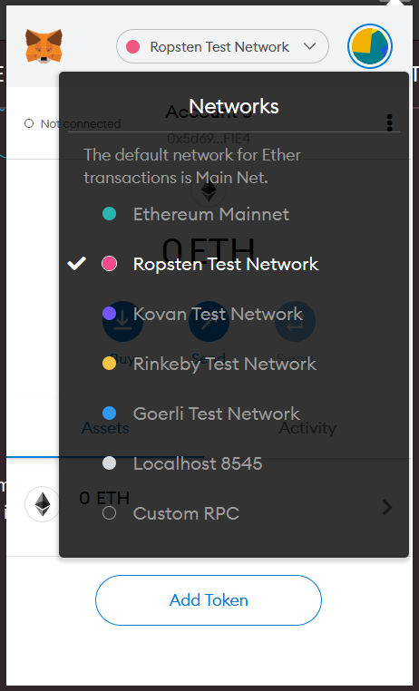
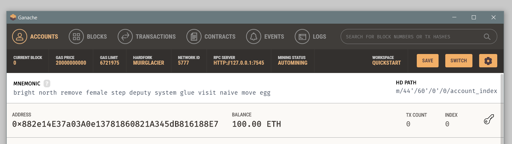

# ELX - front end

Front end for ELX application. Written using Angular and Angular Material 10.
Supported by smart contracts in Solidity and Firebase.

## Installing and running the application

Requirements: npm 6+ (more or less), an Ethereum client and a Firebase project (optional).

### Compiling the contracts

To compile contracts, [Truffle](https://www.trufflesuite.com/docs/truffle/overview) is required.
Install it globally using npm:
```shell script
npm install -g truffle
```

Move to the `blockchain` directory and compile them:
```shell script
cd blockchain
truffle compile
```

As a result, you should see the following output:
```
Compiling your contracts...
===========================
> Compiling .\contracts\AbstractEscrow.sol
> Artifacts written to C:\Users\kplich\Documents\prywatne\ELX\ELX-front-end\blockchain\build\contracts
> Compiled successfully using:
   - solc: 0.7.1+commit.f4a555be.Emscripten.clang
```

The compiler does not deploy the contracts on the blockchain; this will happen when users agree to a transaction.

### Setting up the Firebase project

To connect the application to your own Firebase project, change the `firebaseConfig` object in files within the `environments` folder.
If you don't have a Firebase project, [create it](https://firebase.google.com/docs/web/setup?authuser=0#node.js-apps).
There's no guarantee if the configuration provided will work.

### Running a blockchain network
For a development blockchain network, it's best to use [Ganache](https://www.trufflesuite.com/ganache).
For a one-time run, it should be enough to run a 'quickstart' network.

To connect to the blockchain in the browser, [MetaMask](https://metamask.io/) can be used - it's available for Chrome, Firefox, Brave and Edge.
Change the network by choosing 'Custom RPC' from the dropdown menu at the top of the extension.
Give your network a name in the 'Network Name' field.



In the 'New RPC URL' enter the 'RPC server' from Ganache.  



### Install and run the application locally

This application uses Node to manage its dependencies.
To install it, run `npm install` within the top-level directory.
Then, to run the application, run:
```shell script
npm run local
```

### Build and deploy the application
For a production build, run:
```shell script
npm run build
npm run start
```


## Running tests
To test the application once, run:
```shell script
npm run test
```

To keep the tests running and watching for changes, run:
```shell script
npm run test:watch
```

To test the contracts, you also need a blockchain network available at the address 127.0.0.1:8080. When it's running, execute:
```shell script
cd blockchain
truffle test
```

